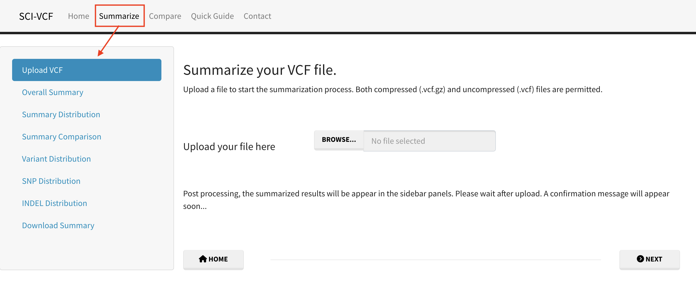
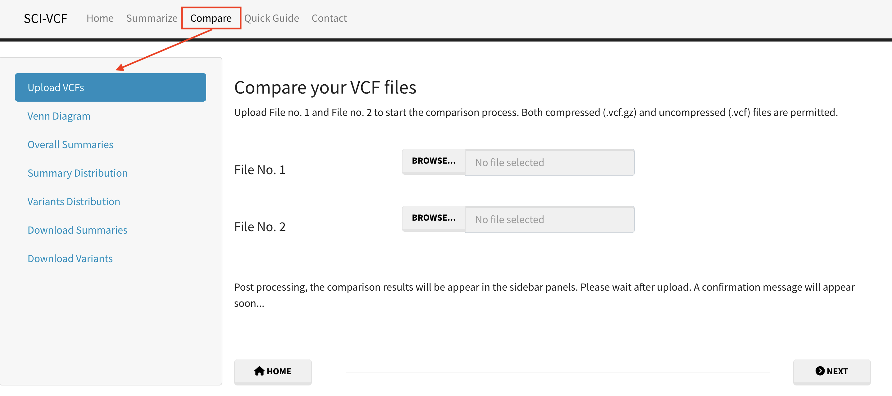
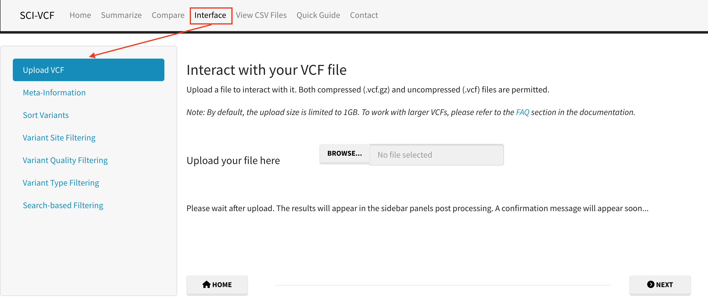

# Getting Started

A guide to understand the workflows and submodules of SCI-VCF for summarizing, comparing, visualizing and analysing your VCF files.

## Summarize 

The summary of a VCF file is generated by classifying variants and summing up unique entries in each category. 
    

### Summarize Submodules

+ Upload VCF: Click the browse button and upload a VCF file.
+ Overall Summary: Get an overall summary of the distribution of variants in each variant type.
+ Summary Distribution: Visualize the distribution of different variant metrics along different contigs.
+ Summary Comparison: Compare the distribution of variant metrics with each other.
+ Variant Distribution: Visualize the occurrence of variants in different genomic ranges.
+ SNP Distribution: Plot the count for all 12 possible SNP types in the VCF.
+ INDEL Distribution: Plot the size distribution of INDELs in the VCF
+ Download Summary: Extract the results as a tabular dataset for further analysis.

## Compare

Unique and common variants in two VCF files are identified by using the first eight mandatory columns as two-dimensional heterogeneous tabular datasets.

### Compare Submodules

+ Upload VCFs: Click the browse button and upload two VCF files in order.
+ Venn Diagram: View area-proportional Venn diagram depicting the number of common and unique variant types.
+ Overall Summaries: Get overall summaries for various variant types for unique and common variants.
+ Summary Distribution: Visualize the distribution of different variant metrics along contigs for common and unique variants.
+ Variants Distribution: Visualize the occurrence of unique and common variants in different genomic ranges.
+ Download Summaries: Extract the results as a tabular dataset for further analysis.
+ Download Variants: Extract the common and unique variants as a tabular dataset for further analysis.

## Interface

SCI-VCF offers a framework to view, search, sort, identify, and filter the contents of a VCF file.

### Interface Submodules

+ Upload VCF: Click the browse button and upload a VCF file.
+ Meta-Information: View, search, and download the meta-information present in the uploaded file.
+ Sort Variants: Sort variants in ascending order of CHROM, POS, REF, and ALT columns. Unique variant IDs can also be added in CHROM_POS_REF_ALT format.
+ Variant Site Filtering: Filter variants from a particular genomic region.
+ Variant Quality Filtering: Filter variants based on the FILTER and QUAL columns.
+ Variant Type Filtering: Filter SNPs and INDELs separately.
+ Search-based Filtering: View the contents of a VCF file and filter based on keyword search.